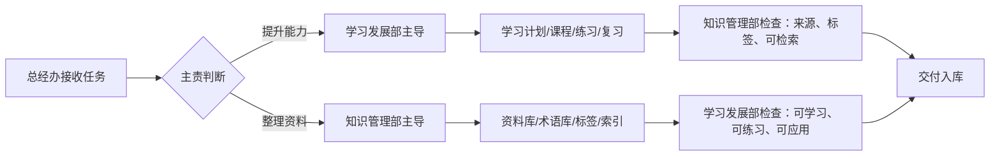

# 学习发展部 × 知识管理部协作 SOP

## 目标

让学习发展部和知识管理部形成双主线程协作：

- 学习发展部负责把知识变成能力。
- 知识管理部负责把材料变成资产。

## 主责判断

学习发展部主导：

- 制定学习计划
- 设计课程
- 设计练习
- 安排复习
- 诊断学习卡点
- 把内容转成求职、项目、面试能力

知识管理部主导：

- 收集资料
- 清洗摘要
- 标准化术语
- 维护标签
- 建立索引
- 归档和去重
- 筛选共享记忆候选

## 双线程流程

## 互相监督规则

- 学习发展部可以退回“太整洁但不好学”的知识条目。
- 知识管理部可以退回“很有感觉但不可追溯”的学习笔记。
- 重要 SOP、角色定义和权限边界变更仍按 SecondMe 权限模型处理。
- 删除、覆盖、批量移动重要资料需要 Vince 明确批准。

## 交付标准

每次协作至少留下一个明确结果：

- 学习计划
- 课程目录
- 练习题
- 复习卡片
- 知识条目
- 术语卡片
- 参考资料库
- 标签建议
- 待确认问题
- 下一步任务

