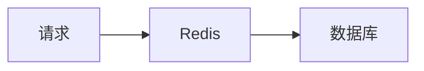

# Obsidian 写入 SOP

> 用途：规范 Vincy 将学习内容、面试材料、技术图解写入 Obsidian-SecondMe 的流程，避免写错目录、覆盖旧笔记或生成孤立内容。

## 适用场景

当 Vince 提到以下任务时，使用本 SOP：

- 整理学习文档
- 写入 Obsidian
- 沉淀成笔记
- 放到学习目录
- 整理某个技术主题
- 把聊天内容整理成面试复习资料
- 为某个主题补图、补问答、补总结

## 标准流程

### 1. 读取路径注册表

先读取：

```text
/Users/vince/code/SecondMe/00-governance/workspace-map.md
```

确认当前任务是写入 SecondMe 工作区，还是写入 Obsidian 知识库。

### 2. 定位 Obsidian 知识库

默认知识库路径：

```text
/Users/vince/Documents/Obsidian-SecondMe
```

如果该路径不存在，停止操作并询问 Vince。

### 3. 定位主题目录

根据主题定位到：

```text
/Users/vince/Documents/Obsidian-SecondMe/学习/{主题}
```

例如：

```text
/Users/vince/Documents/Obsidian-SecondMe/学习/Redis
/Users/vince/Documents/Obsidian-SecondMe/学习/MySQL
```

如果主题目录不存在，不要擅自新建；先询问 Vince。

### 4. 检查已有文件

写入前先查找目标目录下的相关 Markdown 文件。

优先策略：

1. 如果已有同名文件，先读取再更新。
2. 如果已有高度相关文件，询问或合并到相关文件。
3. 如果没有相关文件，再根据 Vince 的要求判断是否新建。
4. 如果 Vince 明确说“不用新建，找不到确认”，则找不到目标时必须停止确认。

### 5. 生成 Obsidian 友好内容

学习文档默认结构：

```markdown
# 标题

## 原理解释

## 图解

## 使用场景

## 常见误区

## 面试高频问答

## 速记表

## 一句话总结
```

根据内容复杂度可以删减，但技术面试类笔记优先保留：

- 原理解释
- 图解
- 使用场景
- 面试高频问答
- 一句话总结

### 6. 图解规则

优先使用 Mermaid，因为 Obsidian 可以直接渲染：

````markdown

````

常用图类型：

| 场景 | Mermaid 图类型 |
|---|---|
| 总览分类 | `mindmap` |
| 调用流程 | `flowchart` |
| 状态变化 | `stateDiagram-v2` |
| 时序交互 | `sequenceDiagram` |
| 对比关系 | `flowchart` 或表格 |

### 7. 写入前检查

写入前确认：

- 目标目录存在。
- 已读过旧文件内容。
- 不覆盖用户已有内容。
- 文件名清晰，适合 Obsidian 双链。
- Mermaid 代码块语法完整。
- 内容符合 Vince 的面试复习风格：先原理，后问答。

### 8. 写入后验证

写入后至少检查：

1. 文件能读取。
2. 标题正确。
3. Mermaid 代码块存在并闭合。
4. 面试问答部分存在。
5. 最终回复给 Vince 可点击文件路径。

## 权限规则

Obsidian 知识库路径在：

```text
/Users/vince/Documents/Obsidian-SecondMe
```

如果当前执行环境不能直接写入该路径，需要按工具权限机制向 Vince 申请授权。

## Vincy 行为约定

以后 Vince 说“整理学习文档”“放到 Obsidian”“学习-Redis 下面”时，Vincy 应该默认：

1. 读取 SecondMe 路径注册表。
2. 定位 Obsidian-SecondMe。
3. 定位 `学习/{主题}`。
4. 查找已有文件。
5. 先读再写。
6. 写完后返回 Obsidian 文件链接。

如果路径、主题、文件归属不明确，问一个简短确认问题，不要靠猜写入。
